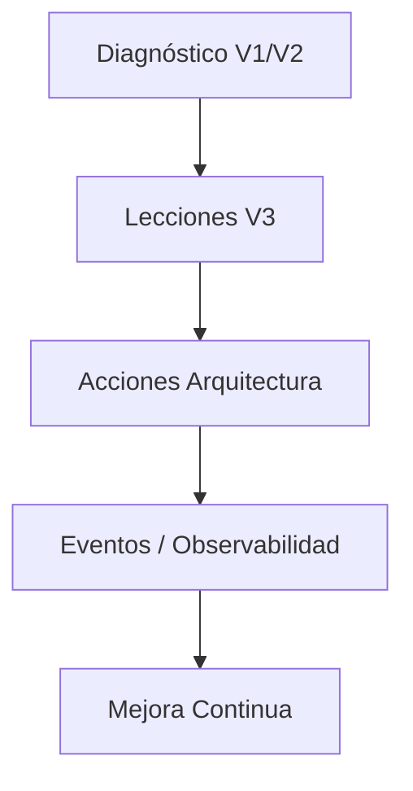

# Lecciones y Errores Críticos de V1/V2 (Transferidos a V3)

Fecha de consolidación: 2025-11-07
Responsable: Equipo de arquitectura V3

Este documento captura los problemas, diagnósticos y correcciones de las versiones previas para evitar pérdida de aprendizaje al reconstruir la plataforma en V3.

---
## 1. Problema Crítico: Ausencia de Precios Guardados
**Síntoma:** 0 precios almacenados pese a múltiples ejecuciones de scraping.
**Diagnóstico fuente:** `DIAGNOSTICO_FINAL_20251107.md`
**Causas raíz:**
- Selectores CSS obsoletos en Airbnb tras cambio de HTML (nov 2025).
- Falta de extracción desde fuentes alternativas (JSON embebido, scripts, regex).
- Incapacidad para diferenciar entre "no disponible" y "fallo de extracción".
- Parámetros de fecha en URL para Airbnb ignorados (véase problema crítico URL).

**Lecciones para V3:**
- Definir un motor de extracción multi-estrategia (DOM, JSON, API intercept, regex).
- Registrar causa granular de fallo (selector_fallido, bloqueo_captcha, layout_cambiado, fecha_no_valida).
- Incluir validación semántica de resultado (precio en rango, estructura esperada, disponibilidad confirmada).
- Separar estados: {NO_DISPONIBLE_REAL, ERROR_EXTRACCION, BLOQUEO, PENDIENTE_INTERACCION}.

**Acciones V3:**
- Diseño de `ExtractionEngine` con pipeline y fallback jerárquico.
- Sistema de eventos: `ScrapeAttempted`, `ScrapeFallbackActivated`, `ScrapePriceExtracted`, `ScrapeFailed`.
- Observabilidad: métrica tasa_fallas_por_plataforma + razón.

---
## 2. Problema Crítico: URL Airbnb Ignora Parámetros
**Síntoma:** Al cargar URLs con `?checkin=&checkout=` la página muestra "Añade las fechas" y nunca aparece precio.
**Diagnóstico fuente:** `PROBLEMA_CRITICO_URL_AIRBNB.md`
**Causa raíz:** Cambios de Airbnb en formato de parámetros / requerimiento de interacción o parámetros alternativos (`check_in`, `check_out`, `currency`, etc.).

**Lecciones para V3:**
- No depender exclusivamente de query params para búsquedas de fechas.
- Implementar robots con capacidad de interacción (simular selección de fechas en calendario).
- Detectar automáticamente cuando los parámetros de URL no se aplican (verificar estado de UI post-navegación).

**Acciones V3:**
- Módulo `Navigator` con funciones: `open_base_url`, `select_dates(check_in, check_out)`, `verify_date_applied()`.
- Pruebas de smoke automatizadas: cargar N URLs y confirmar que el precio aparece tras interacción.
- Fallback: intento de reconstrucción de URL con variantes paramétricas + captura de HTML para diff.

---
## 3. Precio Irrisorio Extraído
**Síntoma:** Precio absurdo (p.ej. $13,861,461,146,138.50) aceptado.
**Diagnóstico fuente:** `CORRECCIONES_PRECIO_DISPONIBILIDAD.md`
**Causa raíz:** Falta de validación de rango y parsing ingenuo de cualquier número.

**Lecciones para V3:**
- Validación de regla de negocio en capa de normalización: rango razonable configurable por plataforma / mercado.
- Detección de valores atípicos (outliers) con heurísticas (IQR, desviación estándar) y marca de calidad.

**Acciones V3:**
- Agregar `PriceValidationPolicy` configurable (mínimo, máximo, moneda esperada).
- Evento `PriceRejected` cuando precio no pasa validaciones.
- Registro de valor bruto y causa de rechazo (para auditoría).

---
## 4. Guardado Incorrecto de Disponibilidad Multi-Noche
**Síntoma:** Precio encontrado para 2 noches guardaba solo la primera noche.
**Diagnóstico fuente:** `CORRECCIONES_PRECIO_DISPONIBILIDAD.md`
**Causa raíz:** Modelo centrado en una sola fecha sin expansión al rango.

**Lecciones para V3:**
- Diferenciar entre precio por noche y precio total del rango.
- Expandir disponibilidad sobre cada fecha del período cuando se confirma.

**Acciones V3:**
- Introducir entidades: `StayQuote` (rango) y `NightlyObservation` (fecha individual derivada).
- Pipeline: `RawQuote` -> `ExpandedNightlyObservations`.

---
## 5. Tiempos de Espera Excesivos y Bloqueos de UI
**Síntoma:** Scraping lento (23s por URL Airbnb) y UI congelada hasta finalizar.
**Diagnóstico fuente:** `MEJORAS_IMPLEMENTADAS_20251107.md`
**Causas raíz:** Esperas estáticas elevadas y ejecución sin streaming de progreso en Streamlit.

**Lecciones para V3:**
- Uso de esperas dinámicas basadas en condiciones (wait-for selector, red network quiet, heurística de DOM estable).
- Separar UI de pipeline: ejecutar scraping asíncrono / desacoplado (task runner, cola de trabajos).
- Progreso observable desde panel (estado por URL, duración, error, retries).

**Acciones V3:**
- Integrar `TaskOrchestrator` con colas (ej. Redis/NATS) y workers independientes.
- Métricas de duración por etapa (navegación, extracción, normalización).
- UI consumiendo estado vía API/polling/websocket.

---
## 6. Falta de Diferenciación de Tipos de Fallo
**Síntoma:** Todos los fallos caen en "no disponible" sin granularidad.
**Causas:** Ausencia de taxonomía de errores y códigos.

**Lecciones para V3:**
- Establecer catálogo de errores: `SELECTOR_MISSING`, `LAYOUT_CHANGED`, `BLOCKED_CAPTCHA`, `REQUEST_DROPPED`, `NETWORK_TIMEOUT`, `ANTIBOT_INTERACTION_REQUIRED`.
- Registrar cada intento con outcome estructurado.

**Acciones V3:**
- Evento `ScrapeAttempt` con campos: {url, plataforma, estrategia, timestamp}.
- Evento `ScrapeFailure` con {error_codigo, mensaje, stack(optional), html_snapshot_path}.
- Persistir errores en tabla `scrape_events` para análisis histórico.

---
## 7. Dependencia Estática de Selectores CSS
**Síntoma:** Roturas masivas tras cambios menores en HTML.

**Lecciones para V3:**
- Incorporar extracción de datos desde JSON embebido y endpoints de API.
- Gestión de selectores versionada: `selectors/<plataforma>/<fecha>.json` + fallback.
- Sistema de verificación nocturna que detecte cambios (diff de DOM crítico).

**Acciones V3:**
- `SelectorRegistry` con prioridad y fecha de validez.
- Test automatizado diario que marca `selector_health`.
- Alertas si health < umbral (ej. 70%).

---
## 8. Falta de Separación entre Datos Brutos y Normalizados
**Síntoma:** El modelo mezclaba precio procesado con flags semánticos.

**Lecciones para V3:**
- Separar `RawObservation` (captura original) de `NormalizedObservation` (ajustada, limpia, validada).
- Permitir reprocesamiento sin repetir scraping.

**Acciones V3:**
- Tablas: `raw_observations`, `normalized_observations` con referencia y estado.
- Worker de normalización independiente.

---
## 9. Testing Insuficiente y Foco en End-to-End
**Síntoma:** Tests centrados en flujo global sin aislar estrategias de extracción, validación, expansión de noches.

**Lecciones para V3:**
- Testing por capas: unit (extractor, validador), integration (pipeline transformación), contract (robots), e2e (flujo completo).
- Fakes de HTML y snapshots versionados.

**Acciones V3:**
- Carpeta `tests/unit/extraction/`, `tests/unit/normalization/`, `tests/integration/pipeline/`.
- Registros de fixtures HTML en `tests/fixtures/html/`.

---
## 10. Observabilidad Limitada
**Síntoma:** Difícil medir tasa de éxito y causas de fallo.

**Lecciones para V3:**
- Centralizar logs estructurados (JSON) + métricas (Prometheus) + panel (Grafana).
- Métricas clave: `scrape_success_rate`, `avg_scrape_duration`, `selector_failure_rate`, `price_outlier_rate`.

**Acciones V3:**
- Emisión de eventos + adaptador a Prometheus.
- Dashboard observabilidad con alertas.

---
## 11. Riesgo Anti-bot y Stealth Limitado
**Síntoma:** Potencial bloqueo futuro por heurísticas simples.

**Lecciones para V3:**
- Rotación de fingerprints (UA, viewport, timezone, languages).
- Inyección de pequeñas interacciones humanas sintéticas (scroll, hover, delay variable).
- Alternar drivers (Playwright + HTTP API directas donde posible).

**Acciones V3:**
- `HumanInteractionSimulator`.
- Política adaptativa: elevar stealth si failure_rate > umbral.

---
## 12. Monolito Streamlit Bloqueante
**Síntoma:** UI bloqueada durante scraping prolongado.

**Lecciones para V3:**
- Separar UI de backend (API + workers).
- Streamlit sólo como fachada de consulta y control.
- Soporte para ejecución asíncrona y cancelación.

**Acciones V3:**
- Introducir `api/` (FastAPI) para operaciones y estado.
- Jobs en background (RQ/Celery/Arq) gestionando scraping.

---
## Síntesis Prioritaria para Fases Iniciales V3
1. Motor de extracción con multi-estrategia + validaciones (Fase 1).
2. Modelo dual raw/normalized + eventos de scraping (Fase 2).
3. Infra de observabilidad y testing por capas (Fase 3).
4. Interacción dinámica para plataformas resistentes (Fase 4).
5. Migración a arquitectura asincrónica (cola + workers) (Fase 5).

---
## Integración con Constitución V3
- Este documento se enlaza desde `CONSTITUCION_V3.md` y `ARQUITECTURA_V3.md` como fuente de verdad sobre aprendizaje histórico.
- Cada lección se convertirá en una historia técnica del backlog inicial.

---
## Referencias Origen
- legacy/docs/DIAGNOSTICO_FINAL_20251107.md
- legacy/docs/PROBLEMA_CRITICO_URL_AIRBNB.md
- legacy/docs/CORRECCIONES_PRECIO_DISPONIBILIDAD.md
- legacy/docs/MEJORAS_IMPLEMENTADAS_20251107.md

---
## Próxima Actualización
Actualizar cuando aparezcan nuevas causas raíz o se complete implementación de cada bloque de acción.

